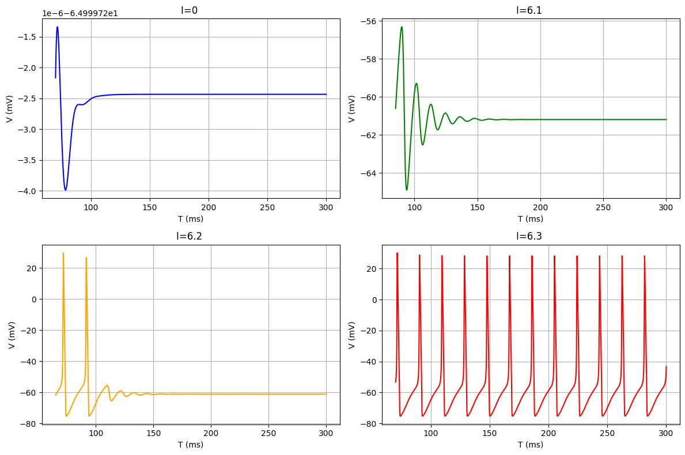
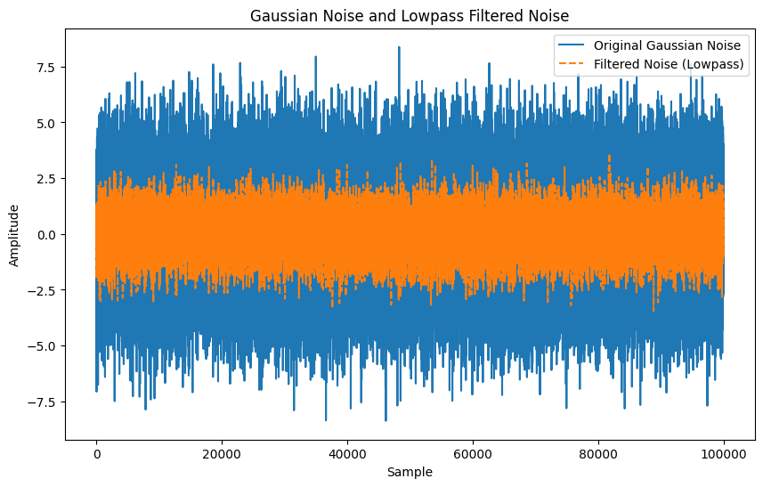
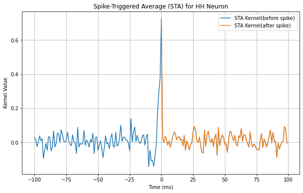
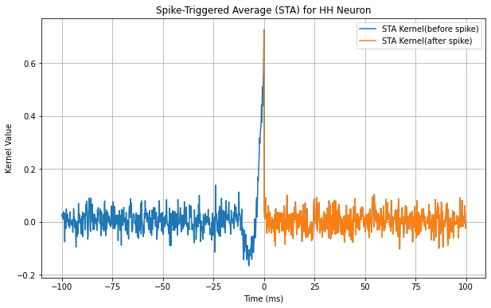

## 作业1: 
通过Runge-Kutta法模拟计算静息电位

$$C \frac{d V}{d t}=I_{e x t}-g_{N a} m^3 h\left(V-V_{N a}\right)-g_K n^4\left(V-V_K\right)-g_L\left(V-V_L\right)$$

$\mathrm{Na}^{+}$ activation Units: 

$$\tau_m \frac{d m}{d t}=-m+m_{\infty}(V), \quad \tau_m=\frac{1}{\alpha_m+\beta_m}, m_{\infty}=\frac{\alpha_m}{\alpha_m+\beta_m}$$

$\mathrm{Na}^{+}$ inactivation Units:

$$\tau_h \frac{d h}{d t}=-h+h_{\infty}(V), \tau_h=\frac{1}{\alpha_h+\beta_h}, h_{\infty}=\frac{\alpha_h}{\alpha_h+\beta_h}$$

$\mathrm{K}^{+}$ activation Units: 

$$\tau_n \frac{d n}{d t}=-n+n_{\infty}(V), \tau_n=\frac{1}{\alpha_n+\beta_n}, n_{\infty}=\frac{\alpha_n}{\alpha_n+\beta_n}$$

$$\begin{aligned}
& \alpha_m(V)= \frac{0.1 \cdot(V+40)}{1-e^{-(V+40) / 10}} \\
& \beta_m(V)= 4 e^{-(V+65) / 18} \\
& \alpha_h(V)= 0.07 e^{-(V+65) / 20} \\
& \beta_h(V)= \frac{1}{e^{-(V+35) / 10}+1} \\
& \alpha_n(V)= \frac{0.01 \cdot(V+55)}{1-e^{-(V+55) / 10}} \\
& \beta_n(V)= 0.125 \cdot e^{-(V+65) / 80} \\
\end{aligned}$$

### 结果展示
#### 欧拉法：
模拟时间间隔为 dt = 0.001 ms
模拟总时长为 tfinal = 300 ms

#### Runge-Kutta法:
模拟时间间隔为 dt = 0.01 ms
模拟总时长为 tfinal = 300 ms

使用Runge-Kutta法对dt的要求更低.

---
## 作业2

尝试通过HH模型spike train计算Spike-Triggered Average
### 结果展示

1. 模拟信号:
	+ cos信号+ 低通滤波  
	+ 模拟结果
		+ 以下两张图数据是一样的，区别是画图的采样点频率不同，后图画图使用的点更多。蓝色曲线为spike之前的刺激强度，橙色为spike之后的刺激强度。
		+ 
		  # HH-Spike-Triggered-Average
